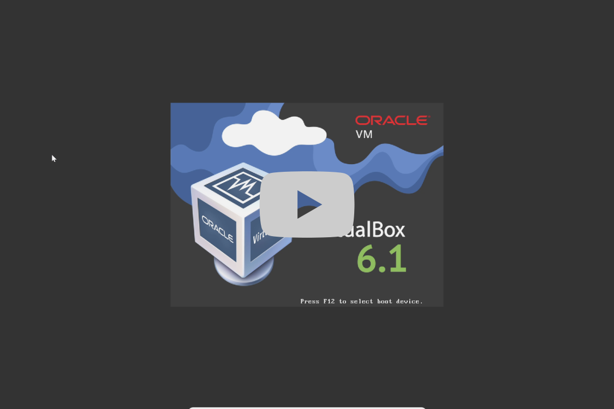
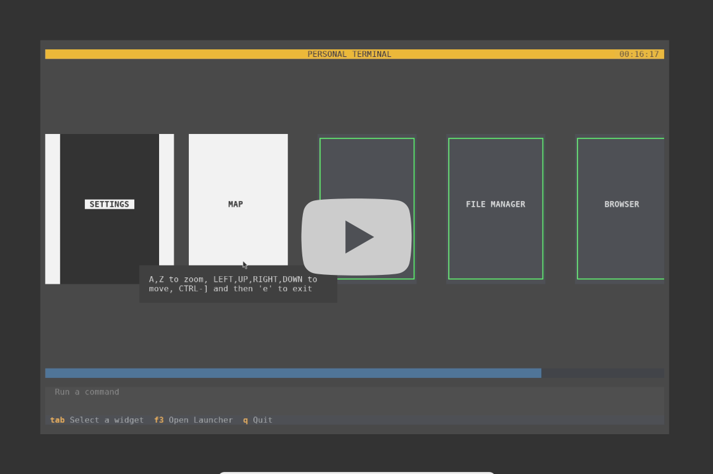
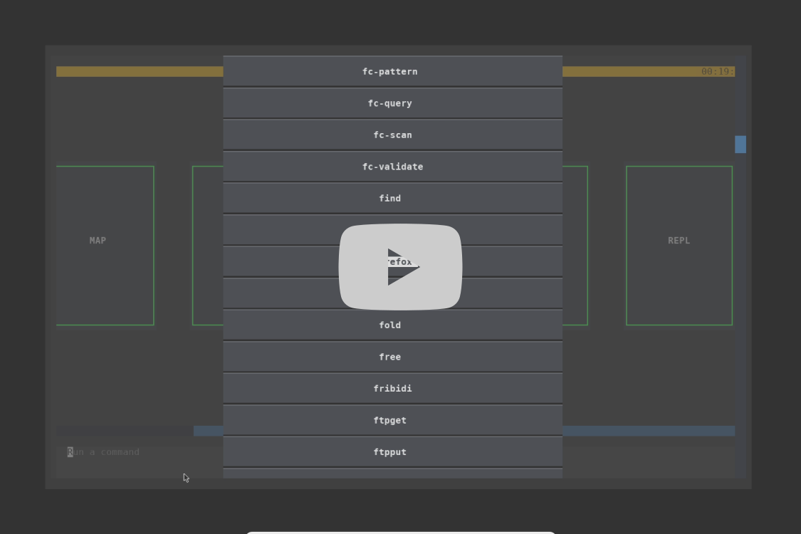

# Python OS - TBD, name to be determined

This project is a spiritual successor to [Snakeware](https://github.com/joshiemoore/snakeware), an attempt to create an OS similar to Commodore [KERNAL](https://www.c64-wiki.com/wiki/Kernal) but running Python instead of BASIC programming language. This is my solution for the second-hand DOS nostalgia problem, as I didn't experience the era first-hand.

Although an interesting project with great technical features, such as replacing X11 with PyGame that draws directly to `/dev/fb0`, Snakeware has a number of limitations:

-   it is abandoned, as the last commit goes back 3 years
-   it doesn't have proper terminal support - all commands need to be wrapped with `os.system()` calls. However, my proposed [solution](https://github.com/joshiemoore/snakeware/discussions/190) was ignored, as no one responds to issues anymore:

```python
class TerminalCommand(Command):
    def run(self):
        import os

        os.system("clear")

        while True:
            cmd = input("$ ")
            if cmd.lower() in ("q", "quit"):
                break
            os.system(cmd)


terminal = TerminalCommand()
```

-   it doesn't have networking and the ability to install additional packages and software

## Features

-   TUI written with [Textual](https://textual.textualize.io/) inspired by Sevastolink terminals in the game Alien: Isolation and other games such as Atomic Heart

    -   maintained as a separate project at https://github.com/sergeyyurkov1/pythonui (currently in Alpha)

-   Command-line interface with the ability to install and run Python and Linux packages including GUI programs such as Firefox
-   Alpine Linux and i3-WM based
-   fully automated build pipeline with Github Actions
-   pre-intalls a set of CLI software: browser, file manager, map! (eat your heart out, Google), and others

## Installation

Please download the latest release from https://github.com/sergeyyurkov1/pythonos/releases/tag/latest

-   Unzip the archive. Inside you will find a VirtualBox .vdi image file
-   Create a new virtual machine in VirtualBox
    -   select `Linux` - `Other Linux (64-bit)`
    -   attach the .vdi image
    -   make sure to assign >= 2 processor cores to the machine in the `System -> Processor` tab, otherwise it will fail to boot (this is an issue with VirtualBox on some hardware configurations)
-   Run the machine
    -   you will be greeted with a shell login prompt - username and password are `pui` (can be changed if desired)
    -   you should see the default i3-WM screen. Press `Enter` key twice to generate a config file - use `Win` key as modifier key
-   Open a terminal window by pressing `Win-Enter`
-   Install Python UI (wait until the process finishes, ignore the "externally-managed-environment" error)

```bash
  $ install-pui
```

-   Reboot the machine by typing `doas reboot` in the terminal

On the second run you will be greeted with a blank terminal window with no default i3-WM decorations. The system is now configured. Type `pui` to enter Python UI. If nothing happens, please reinstall Python UI with the `install-pui` command.

[](https://gitlab.com/sergeyyurkov1/store/-/raw/main/2024-11-14_00-12-34_-_1.mp4?ref_type=heads&inline=true)

## Usage

-   Use `Tab` and `Shift-Tab` to navigate the interface
-   Press `F3` to run the graphical ( "traphical"? Because "TUI" ) program Launcher
-   run arbitrary commands with the prompt at the bottom of the screen
-   by default GUI programs such as Firefox launch on the right side of the screen with terminal command running on the left side. To enter and exit fullscreen mode use `Win-F`; press `Ctrl-C` to exit the terminal. Use `Win`+arrow keys to switch between windows in split mode to focus and launch the correct window in fullscreen
-   press `Win-Shift-Q` to force close a window if experiencing issues and return to a blank screen (_note:_ this action exits Python UI)
-   press `Win-Enter` to launch the default terminal window you are greeted with on login. Press `Win-Enter` to launch more terminal windows in split mode
-   more to come...

Refer to [i3 User’s Guide](https://i3wm.org/docs/userguide.html) for more ways to interact with the window manager.

## Demo

[](https://www.bilibili.com/video/BV1yNBZYuENB/)

<!-- [](https://gitlab.com/sergeyyurkov1/store/-/raw/main/2024-11-14_00-12-34_-_2_-_1.mp4?ref_type=heads&inline=true)

[](https://gitlab.com/sergeyyurkov1/store/-/raw/main/2024-11-14_00-12-34_-_2_-_2.mp4?ref_type=heads&inline=true) -->

## Roadmap

-   Add Chinese and Russian font support. Currently only English is supported
-   Fix performance issues and add 3D acceleration for games

## Contributing

TBA

## License

[MIT](https://choosealicense.com/licenses/mit/)
